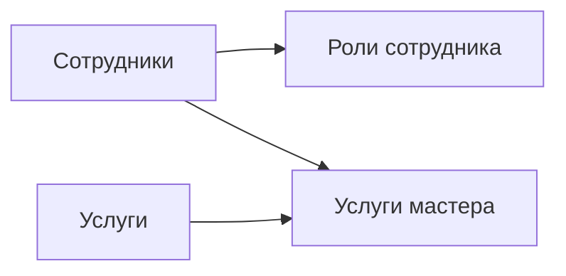

# Exercise 01 — Экранные формы классификаторов и справочников

------

## 1. Список классификаторов и справочников

**Таблица 1.1 — Перечень справочников и классификаторов**

| №    | Наименование        | Тип                  | Связанные справочники / классификаторы                |
| :--- | :------------------ | :------------------- | :---------------------------------------------------- |
| 1    | **Сотрудники**      | Справочник           | — (самостоятельный)                                   |
| 2    | **Роли сотрудника** | Классификатор        | Сотрудники (FK: employee_id)                          |
| 3    | **Услуги**          | Справочник           | — (самостоятельный)                                   |
| 4    | **Услуги мастера**  | Связующий справочник | Сотрудники (FK: employee_id), Услуги (FK: service_id) |

######                                                               СВЯЗЬ МЕЖДУ СПРАВОЧНИКАМИ



## 2. Макеты (эскизы) экранных форм

### 2.1. Справочник «Сотрудники»

text

```
┌─────────────────────────────────────────────────────────────────────────────┐
│  ^ ФРЕЙМ ЗАГОЛОВКА                                                          │
│  СОТРУДНИКИ                                                  [Администратор]│
├─────────────────────────────────────────────────────────────────────────────┤
│  ^ ФРЕЙМ ОБЕСПЕЧИВАЮЩИХ ОПЕРАЦИЙ (ФИЛЬТРАЦИЯ/ПОИСК)                          │
│  [Поиск: ФИО / телефон ______________]  [🔍]                               │
│  [Фильтр: Статус ▼]  [Фильтр: Должность ▼]  [Применить]  [Сбросить]        │
├─────────────────────────────────────────────────────────────────────────────┤
│  ^ ФРЕЙМ ОСНОВНОЙ ОПЕРАЦИИ                                                  │
│  [ + Добавить сотрудника ]                                                  │
├─────────────────────────────────────────────────────────────────────────────┤
│  ^ ФРЕЙМ СПИСКА                                                             │
│  ┌─────┬─────────────────────┬─────────────────┬───────────┬──────────────┐│
│  │ №   │ ФИО сотрудника      │ Телефон         │ Статус    │ Действия     ││
│  ├─────┼─────────────────────┼─────────────────┼───────────┼──────────────┤│
│  │ 1   │ Воробьёв Д.С.       │ +7 (999) 123-45-67│ Работает  │ [✏️] [🗑]    ││
│  │ 2   │ Носова А.В.         │ +7 (999) 234-56-78│ Работает  │ [✏️] [🗑]    ││
│  │ 3   │ Смирнов П.П.        │ +7 (999) 345-67-89│ Уволен    │ [✏️] [🗑]    ││
│  └─────┴─────────────────────┴─────────────────┴───────────┴──────────────┘│
├─────────────────────────────────────────────────────────────────────────────┤
│  ^ ФРЕЙМ ПАГИНАЦИИ                                                          │
│  Записей: 3  │  [◀ Назад] Стр. 1 из 1 [Далее ▶]                           │
├─────────────────────────────────────────────────────────────────────────────┤
│  ^ ФРЕЙМ ОПЕРАЦИЙ ПЕРЕХОДА                                                  │
│  [← На главную]                                                             │
└─────────────────────────────────────────────────────────────────────────────┘
```


**Вызовы операций, переходы и отмены для справочника «Сотрудники»:**

| Действие                 | Вызов                                  | Переход                                                      | Отказ (отмена)                                              |
| :----------------------- | :------------------------------------- | :----------------------------------------------------------- | :---------------------------------------------------------- |
| Добавить сотрудника      | Нажатие кнопки «+ Добавить сотрудника» | Открытие формы создания карточки сотрудника                  | Закрытие формы без сохранения (кнопка «Отмена» или крестик) |
| Редактировать сотрудника | Нажатие ✏️ в строке списка              | Открытие формы редактирования карточки сотрудника            | Закрытие формы без сохранения                               |
| Удалить сотрудника       | Нажатие 🗑 в строке списка              | Диалог подтверждения «Удалить сотрудника?» → при подтверждении удаление | Закрытие диалога без удаления                               |
| Применить фильтр         | Нажатие «Применить»                    | Обновление списка отфильтрованными данными                   | Нажатие «Сбросить» → сброс фильтров                         |
| Поиск                    | Ввод текста + нажатие «🔍»              | Обновление списка результатами поиска                        | Очистка поля поиска                                         |
| На главную               | Нажатие «← На главную»                 | Переход на SCR-20 (главная страница)                         | —                                                           |
| Пагинация                | Нажатие «◀ Назад» / «Далее ▶»          | Переход на предыдущую/следующую страницу                     | Кнопки блокируются на границах страниц                      |

------

### 2.2. Классификатор «Роли сотрудника»

text

```
┌─────────────────────────────────────────────────────────────────────────────┐
│  ^ ФРЕЙМ ЗАГОЛОВКА                                                          │
│  РОЛИ СОТРУДНИКА                                              [Администратор]│
├─────────────────────────────────────────────────────────────────────────────┤
│  ^ ФРЕЙМ ОБЕСПЕЧИВАЮЩИХ ОПЕРАЦИЙ (ФИЛЬТРАЦИЯ/ПОИСК)                          │
│  [Фильтр: Роль ▼]  [Поиск: ФИО сотрудника ______]  [🔍]  [Сбросить]        │
├─────────────────────────────────────────────────────────────────────────────┤
│  ^ ФРЕЙМ ОСНОВНОЙ ОПЕРАЦИИ                                                  │
│  [ + Добавить роль ]                                                        │
├─────────────────────────────────────────────────────────────────────────────┤
│  ^ ФРЕЙМ СПИСКА                                                             │
│  ┌─────┬─────────────────────┬───────────┬────────────────────────────────┐│
│  │ №   │ ФИО сотрудника      │ Роль      │ Действия                       ││
│  ├─────┼─────────────────────┼───────────┼────────────────────────────────┤│
│  │ 1   │ Воробьёв Д.С.       │ Мастер    │ [✏️ Изменить] [🗑 Удалить]      ││
│  │ 2   │ Воробьёв Д.С.       │ Менеджер  │ [✏️ Изменить] [🗑 Удалить]      ││
│  │ 3   │ Носова А.В.         │ Менеджер  │ [✏️ Изменить] [🗑 Удалить]      ││
│  └─────┴─────────────────────┴───────────┴────────────────────────────────┘│
├─────────────────────────────────────────────────────────────────────────────┤
│  ^ ФРЕЙМ ПАГИНАЦИИ                                                          │
│  Записей: 3  │  [◀ Назад] Стр. 1 из 1 [Далее ▶]                           │
├─────────────────────────────────────────────────────────────────────────────┤
│  ^ ФРЕЙМ ОПЕРАЦИЙ ПЕРЕХОДА                                                  │
│  [← На главную]                                                             │
└─────────────────────────────────────────────────────────────────────────────┘
```


**Вызовы операций, переходы и отмены для классификатора «Роли сотрудника»:**

| Действие       | Вызов                              | Переход                                                 | Отказ (отмена)                |
| :------------- | :--------------------------------- | :------------------------------------------------------ | :---------------------------- |
| Добавить роль  | Нажатие «+ Добавить роль»          | Открытие формы создания (выбор сотрудника + выбор роли) | Закрытие формы без сохранения |
| Изменить роль  | Нажатие ✏️                          | Открытие формы редактирования (смена роли)              | Закрытие формы без сохранения |
| Удалить роль   | Нажатие 🗑                          | Диалог подтверждения → при подтверждении удаление       | Закрытие диалога без удаления |
| Фильтр по роли | Выбор значения в выпадающем списке | Обновление списка                                       | Сброс фильтра                 |
| Поиск          | Ввод текста + «🔍»                  | Обновление списка                                       | Очистка поля поиска           |
| На главную     | Нажатие «← На главную»             | Переход на SCR-20                                       | —                             |

------

### 2.3. Справочник «Услуги»

text

```
┌─────────────────────────────────────────────────────────────────────────────┐
│  ^ ФРЕЙМ ЗАГОЛОВКА                                                          │
│  УСЛУГИ                                                     [Менеджер/Админ]│
├─────────────────────────────────────────────────────────────────────────────┤
│  ^ ФРЕЙМ ОБЕСПЕЧИВАЮЩИХ ОПЕРАЦИЙ (ПОИСК)                                    │
│  [Поиск: Название ______________]  [🔍]  [Сбросить]                         │
├─────────────────────────────────────────────────────────────────────────────┤
│  ^ ФРЕЙМ ОСНОВНОЙ ОПЕРАЦИИ                                                  │
│  [ + Добавить услугу ]                                                      │
├─────────────────────────────────────────────────────────────────────────────┤
│  ^ ФРЕЙМ СПИСКА                                                             │
│  ┌─────┬─────────────────────┬───────────┬───────────┬────────────────────┐│
│  │ №   │ Название услуги     │ Цена      │ Длит.     │ Действия           ││
│  ├─────┼─────────────────────┼───────────┼───────────┼────────────────────┤│
│  │ 1   │ Мужская стрижка     │ 1500 ₽    │ 60′       │ [✏️] [🗑] [📋 Дубл.]││
│  │ 2   │ Стрижка бороды      │ 800 ₽     │ 30′       │ [✏️] [🗑] [📋 Дубл.]││
│  │ 3   │ Комплекс (стр.+бор.)│ 2000 ₽    │ 90′       │ [✏️] [🗑] [📋 Дубл.]││
│  └─────┴─────────────────────┴───────────┴───────────┴────────────────────┘│
├─────────────────────────────────────────────────────────────────────────────┤
│  ^ ФРЕЙМ ПАГИНАЦИИ                                                          │
│  Записей: 3  │  [◀ Назад] Стр. 1 из 1 [Далее ▶]                           │
├─────────────────────────────────────────────────────────────────────────────┤
│  ^ ФРЕЙМ ОПЕРАЦИЙ ПЕРЕХОДА                                                  │
│  [← На главную]                                                             │
└─────────────────────────────────────────────────────────────────────────────┘
```


**Вызовы операций, переходы и отмены для справочника «Услуги»:**

| Действие        | Вызов                       | Переход                                           | Отказ (отмена)                |
| :-------------- | :-------------------------- | :------------------------------------------------ | :---------------------------- |
| Добавить услугу | Нажатие «+ Добавить услугу» | Открытие формы создания карточки услуги           | Закрытие формы без сохранения |
| Редактировать   | Нажатие ✏️                   | Открытие формы редактирования                     | Закрытие формы без сохранения |
| Дублировать     | Нажатие 📋                   | Открытие формы создания с предзаполненными полями | Закрытие формы без сохранения |
| Удалить         | Нажатие 🗑                   | Диалог подтверждения → при подтверждении удаление | Закрытие диалога без удаления |
| Поиск           | Ввод текста + «🔍»           | Обновление списка                                 | Очистка поля поиска           |
| На главную      | Нажатие «← На главную»      | Переход на SCR-20                                 | —                             |

------

### 2.4. Справочник «Услуги мастера»

text

```
┌─────────────────────────────────────────────────────────────────────────────┐
│  ^ ФРЕЙМ ЗАГОЛОВКА                                                          │
│  УСЛУГИ МАСТЕРА                                             [Менеджер/Админ]│
├─────────────────────────────────────────────────────────────────────────────┤
│  ^ ФРЕЙМ ОБЕСПЕЧИВАЮЩИХ ОПЕРАЦИЙ (ФИЛЬТРАЦИЯ)                               │
│  [Фильтр: Мастер ▼]  [Фильтр: Услуга ▼]  [Применить]  [Сбросить]           │
├─────────────────────────────────────────────────────────────────────────────┤
│  ^ ФРЕЙМ ОСНОВНОЙ ОПЕРАЦИИ                                                  │
│  [ + Привязать услугу к мастеру ]                                          │
├─────────────────────────────────────────────────────────────────────────────┤
│  ^ ФРЕЙМ СПИСКА                                                             │
│  ┌─────┬─────────────────────┬─────────────────────┬──────────────────────┐│
│  │ №   │ ФИО мастера         │ Услуга              │ Действия             ││
│  ├─────┼─────────────────────┼─────────────────────┼──────────────────────┤│
│  │ 1   │ Воробьёв Д.С.       │ Мужская стрижка     │ [🗑 Удалить]          ││
│  │ 2   │ Воробьёв Д.С.       │ Стрижка бороды      │ [🗑 Удалить]          ││
│  │ 3   │ Носова А.В.         │ Мужская стрижка     │ [🗑 Удалить]          ││
│  └─────┴─────────────────────┴─────────────────────┴──────────────────────┘│
├─────────────────────────────────────────────────────────────────────────────┤
│  ^ ФРЕЙМ ПАГИНАЦИИ                                                          │
│  Записей: 3  │  [◀ Назад] Стр. 1 из 1 [Далее ▶]                           │
├─────────────────────────────────────────────────────────────────────────────┤
│  ^ ФРЕЙМ ОПЕРАЦИЙ ПЕРЕХОДА                                                  │
│  [← На главную]                                                             │
└─────────────────────────────────────────────────────────────────────────────┘
```


**Вызовы операций, переходы и отмены для справочника «Услуги мастера»:**

| Действие         | Вызов                                  | Переход                                                      | Отказ (отмена)                      |
| :--------------- | :------------------------------------- | :----------------------------------------------------------- | :---------------------------------- |
| Привязать услугу | Нажатие «+ Привязать услугу к мастеру» | Открытие формы создания связи (выбор мастера + выбор услуги) | Закрытие формы без сохранения       |
| Удалить связь    | Нажатие 🗑                              | Диалог подтверждения → при подтверждении удаление            | Закрытие диалога без удаления       |
| Применить фильтр | Нажатие «Применить»                    | Обновление списка отфильтрованными данными                   | Нажатие «Сбросить» → сброс фильтров |
| На главную       | Нажатие «← На главную»                 | Переход на SCR-20                                            | —                                   |

------

## 3. Основные операции

### 3.1. Справочник «Сотрудники»

**Таблица 1.2 — Основные операции справочника «Сотрудники»**

| Операция           | Права доступа           | Условия выполнения                                           | Результат в справочнике                                      | Результат в других частях системы                            |
| :----------------- | :---------------------- | :----------------------------------------------------------- | :----------------------------------------------------------- | :----------------------------------------------------------- |
| **Создание**       | Администратор           | Все обязательные поля заполнены. Телефон уникален.           | Новая запись сотрудника добавляется в список.                | Сотрудник становится доступен для выбора в справочниках «Роли сотрудника» и «Услуги мастера». |
| **Чтение**         | Менеджер, Администратор | —                                                            | Отображение списка всех сотрудников с возможностью фильтрации и поиска. | —                                                            |
| **Редактирование** | Администратор           | Запись существует. При изменении статуса на «Уволен» — подтверждение. | Данные сотрудника обновляются в списке.                      | При увольнении — автоматическая отмена будущих слотов, извещение клиентов, удаление из активных привязок. |
| **Удаление**       | Администратор           | У сотрудника нет будущих бронирований.                       | Запись удаляется из списка.                                  | Каскадное удаление из «Роли сотрудника» и «Услуги мастера».  |

### 3.2. Классификатор «Роли сотрудника»

**Таблица 1.3 — Основные операции классификатора «Роли сотрудника»**

| Операция           | Права доступа           | Условия выполнения                                           | Результат в классификаторе                            | Результат в других частях системы                            |
| :----------------- | :---------------------- | :----------------------------------------------------------- | :---------------------------------------------------- | :----------------------------------------------------------- |
| **Создание**       | Администратор           | Сотрудник существует в системе. Роль не дублируется для данного сотрудника. | Новая запись (сотрудник + роль) добавляется в список. | Сотрудник получает права доступа согласно назначенной роли.  |
| **Чтение**         | Менеджер, Администратор | Менеджер видит только мастеров (фильтр по роли «Мастер»).    | Отображение списка назначенных ролей.                 | —                                                            |
| **Редактирование** | Администратор           | При смене роли мастера на другую — подтверждение.            | Роль сотрудника обновляется в списке.                 | При отзыве роли «Мастер» — перенос/отмена будущих слотов, извещение клиентов, удаление из «Услуги мастера». |
| **Удаление**       | Администратор           | У мастера нет будущих бронирований.                          | Запись удаляется из списка.                           | Удаление всех связей из справочника «Услуги мастера» для данного мастера. |

### 3.3. Справочник «Услуги»

**Таблица 1.4 — Основные операции справочника «Услуги»**

| Операция           | Права доступа                   | Условия выполнения                                           | Результат в справочнике             | Результат в других частях системы                            |
| :----------------- | :------------------------------ | :----------------------------------------------------------- | :---------------------------------- | :----------------------------------------------------------- |
| **Создание**       | Менеджер, Администратор         | Обязательные поля заполнены. Название уникально.             | Новая услуга добавляется в список.  | Услуга становится доступна для выбора в справочнике «Услуги мастера» и при бронировании. |
| **Чтение**         | Клиент, Менеджер, Администратор | Клиент видит только активные услуги.                         | Отображение списка услуг.           | —                                                            |
| **Редактирование** | Менеджер, Администратор         | Запись существует.                                           | Данные услуги обновляются в списке. | Не влияет на уже забронированные слоты (стоимость фиксируется на момент бронирования). |
| **Удаление**       | Администратор                   | Нет активных связей в «Услуги мастера». Нет записей на данную услугу за последний год. | Услуга удаляется из списка.         | Удаление всех связей из справочника «Услуги мастера» для данной услуги. |

### 3.4. Справочник «Услуги мастера»

**Таблица 1.5 — Основные операции справочника «Услуги мастера»**

| Операция     | Права доступа                           | Условия выполнения                                           | Результат в справочнике                         | Результат в других частях системы                            |
| :----------- | :-------------------------------------- | :----------------------------------------------------------- | :---------------------------------------------- | :----------------------------------------------------------- |
| **Создание** | Менеджер, Администратор                 | Мастер имеет роль «Мастер». Услуга существует. Связь не дублируется. | Новая связь мастер–услуга добавляется в список. | Мастер становится доступен для выбора при бронировании данной услуги. |
| **Чтение**   | Клиент, Менеджер, Мастер, Администратор | Клиент — при выборе мастера по услуге. Мастер — только свои услуги. | Отображение списка привязанных услуг.           | —                                                            |
| **Удаление** | Менеджер, Администратор                 | Нет будущих бронирований мастера на данную услугу.           | Связь удаляется из списка.                      | Мастер перестаёт быть доступен для выбора при бронировании данной услуги. |

------

## 4. Дополнительные операции

### 4.1. Сортировка

**Таблица 1.6 — Сортировка по справочникам**

| Справочник      | Поля сортировки              | Состояние по умолчанию   |
| :-------------- | :--------------------------- | :----------------------- |
| Сотрудники      | ФИО, Телефон, Статус         | ФИО ↑ (по алфавиту)      |
| Роли сотрудника | ФИО сотрудника, Роль         | ФИО сотрудника ↑         |
| Услуги          | Название, Цена, Длительность | Название ↑ (по алфавиту) |
| Услуги мастера  | ФИО мастера, Услуга          | ФИО мастера ↑, Услуга ↑  |

### 4.2. Фильтрация

**Таблица 1.7 — Фильтрация по справочникам**

| Справочник      | Поля фильтрации                                              | Сохранение фильтра                  | Сообщение при отсутствии результата                      |
| :-------------- | :----------------------------------------------------------- | :---------------------------------- | :------------------------------------------------------- |
| Сотрудники      | Статус (Работает/Уволен/Отпуск), Должность                   | Нет (не сохраняется между сессиями) | «Сотрудников не найдено. Измените параметры фильтрации.» |
| Роли сотрудника | Роль (Мастер/Менеджер)                                       | Нет                                 | «Записей не найдено. Измените параметры фильтрации.»     |
| Услуги          | — (только поиск)                                             | —                                   | —                                                        |
| Услуги мастера  | Мастер (из выпадающего списка), Услуга (из выпадающего списка) | Нет                                 | «Записей не найдено. Измените параметры фильтрации.»     |

### 4.3. Поиск

**Таблица 1.8 — Поиск по справочникам**

| Справочник      | Поля поиска             | Точность совпадения             | Сообщение при отсутствии результата       |
| :-------------- | :---------------------- | :------------------------------ | :---------------------------------------- |
| Сотрудники      | ФИО сотрудника, Телефон | Частичное совпадение (содержит) | «По запросу "[текст]" ничего не найдено.» |
| Роли сотрудника | ФИО сотрудника          | Частичное совпадение (содержит) | «По запросу "[текст]" ничего не найдено.» |
| Услуги          | Название услуги         | Частичное совпадение (содержит) | «По запросу "[текст]" ничего не найдено.» |
| Услуги мастера  | — (только фильтрация)   | —                               | —                                         |

### 4.4. Дублирование

**Таблица 1.9 — Дублирование записей**

| Справочник      | Дублирование | Реализация                                                   |
| :-------------- | :----------- | :----------------------------------------------------------- |
| Сотрудники      | Нет          | Нет смысла (личные данные уникальны, телефон не должен дублироваться) |
| Роли сотрудника | Нет          | Нет смысла (короткие записи, дублирование не требуется)      |
| Услуги          | **Да**       | Кнопка «Дублировать из существующей». При нажатии открывается форма создания с предзаполненными полями (название = «Копия [оригинал]», цена и длительность копируются). Пользователь может изменить поля перед сохранением. |
| Услуги мастера  | Нет          | Нет смысла (связи уникальны по паре мастер–услуга)           |

### 4.5. Расчёт итогов

**Таблица 1.10 — Расчёт итогов по справочникам**

| Справочник      | Итоги                                                      |
| :-------------- | :--------------------------------------------------------- |
| Сотрудники      | Количество записей в списке (с учётом фильтрации и поиска) |
| Роли сотрудника | Количество записей в списке (с учётом фильтрации и поиска) |
| Услуги          | Количество записей в списке (с учётом поиска)              |
| Услуги мастера  | Количество записей в списке (с учётом фильтрации)          |

------

## 5. Логирование

### 5.1. Операции, требующие логирования

**Таблица 1.11 — Логирование операций**

| Справочник      | Операция       | Логирование | Обоснование                               |
| :-------------- | :------------- | :---------- | :---------------------------------------- |
| Сотрудники      | Создание       | Да          | Аудит кадровых изменений                  |
| Сотрудники      | Редактирование | Да          | Аудит изменения данных (особенно статуса) |
| Сотрудники      | Удаление       | Да          | Аудит удаления сотрудников                |
| Роли сотрудника | Создание       | Да          | Аудит назначения прав доступа             |
| Роли сотрудника | Редактирование | Да          | Аудит изменения прав доступа              |
| Роли сотрудника | Удаление       | Да          | Аудит отзыва прав доступа                 |
| Услуги          | Создание       | Да          | Аудит добавления услуг                    |
| Услуги          | Редактирование | Да          | Аудит изменения цен и длительности        |
| Услуги          | Удаление       | Да          | Аудит удаления услуг                      |
| Услуги мастера  | Создание       | Да          | Аудит привязки услуг к мастерам           |
| Услуги мастера  | Удаление       | Да          | Аудит отвязки услуг от мастеров           |

### 5.2. Атрибуты, сохраняемые при логировании

**Таблица 1.12 — Атрибуты логирования**

| Справочник      | Атрибуты                                                     |
| :-------------- | :----------------------------------------------------------- |
| Сотрудники      | employee_id, full_name, phone, status. При редактировании — старое и новое значение каждого изменяемого поля. |
| Роли сотрудника | role_id, employee_id, role_name                              |
| Услуги          | service_id, title, base_price, duration_minutes. При редактировании — старое и новое значение. |
| Услуги мастера  | master_service_id, employee_id, service_id                   |

### 5.3. Служебные поля логирования

**Таблица 1.13 — Служебные поля логирования**

| Поле                  | Описание                                           | Формат                               |
| :-------------------- | :------------------------------------------------- | :----------------------------------- |
| Дата и время операции | Timestamp с точностью до секунды                   | ДД.ММ.ГГГГ ЧЧ:ММ:СС                  |
| ID пользователя       | Идентификатор пользователя, выполнившего операцию  | person_id (число)                    |
| Тип операции          | Категория выполненного действия                    | Создание / Редактирование / Удаление |
| IP-адрес              | IP-адрес устройства, с которого выполнена операция | IPv4 или IPv6                        |
| User-Agent            | Строка браузера/устройства (опционально)           | текст                                |

------

