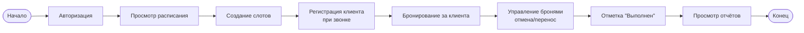
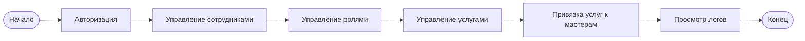
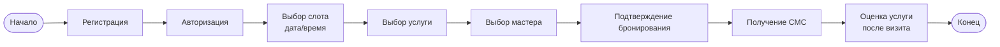
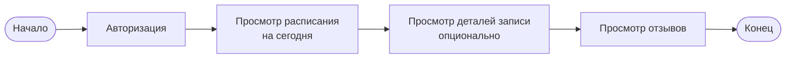
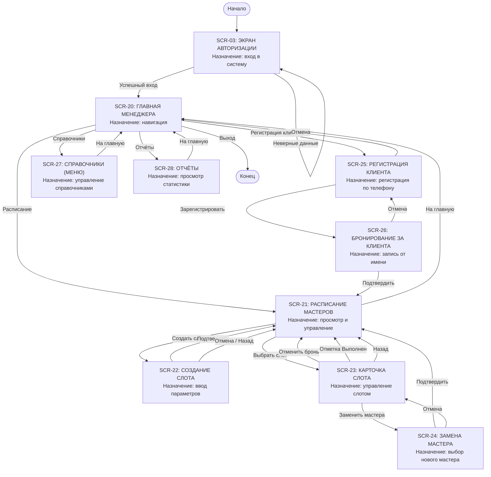
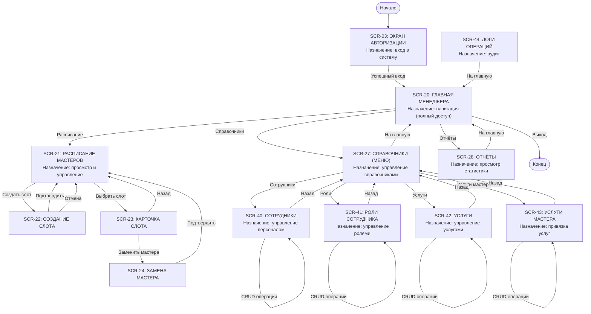
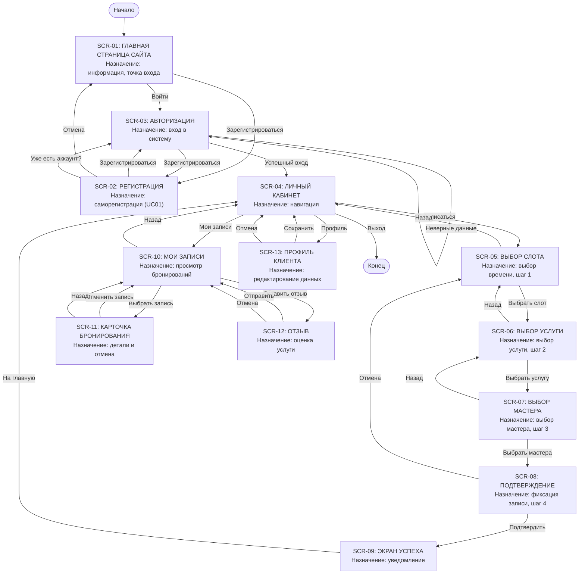
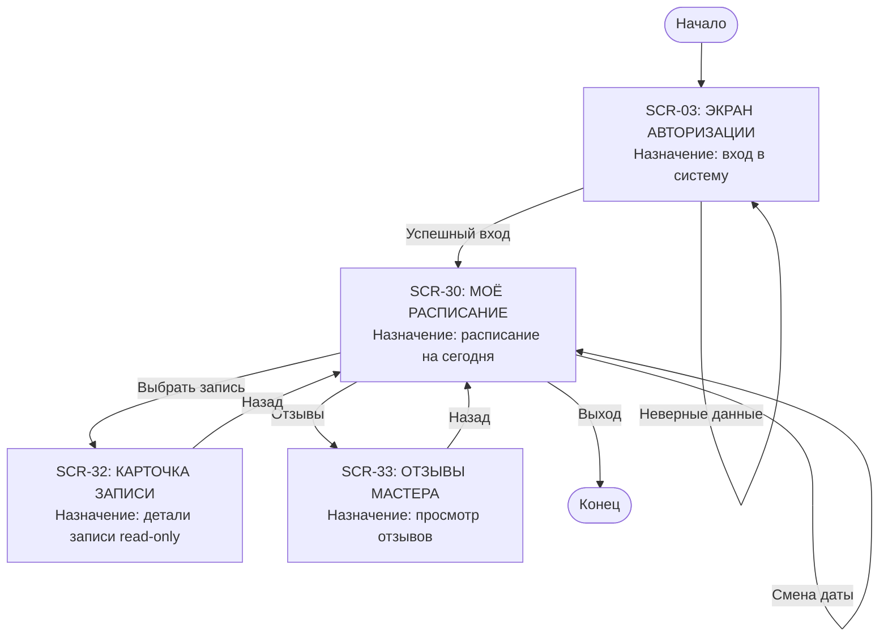

# Exercise 03 — Сценарии ключевых ролей

## 1. Ключевые сценарии основных процессов (текстовое описание)

### 1.1. Роль: Менеджер

**Ключевой сценарий: Формирование расписания и управление бронированиями**

| Шаг  | Действие                                           | Результат                                 |
| :--- | :------------------------------------------------- | :---------------------------------------- |
| 1    | Менеджер входит в систему (логин + пароль)         | Открывается главная страница менеджера    |
| 2    | Менеджер переходит в раздел «Расписание мастеров»  | Отображается расписание на текущую неделю |
| 3    | Менеджер выбирает дату и мастера                   | Отображаются слоты выбранного мастера     |
| 4    | Менеджер создаёт новые слоты                       | Слоты добавляются в расписание            |
| 5    | При звонке клиента — менеджер регистрирует клиента | Клиент добавляется в систему              |
| 6    | Менеджер бронирует слот за клиента                 | Слот получает статус «Забронирован»       |
| 7    | После оказания услуги — отметка «Выполнен»         | Слот получает статус «Выполнен»           |
| 8    | Менеджер просматривает отчёты                      | Отображается статистика                   |

### 1.2. Роль: Владелец (администратор)

**Ключевой сценарий: Управление персоналом и настройка системы**

| Шаг  | Действие                                          | Результат                                   |
| :--- | :------------------------------------------------ | :------------------------------------------ |
| 1    | Владелец входит в систему                         | Открывается главная страница менеджера      |
| 2    | Владелец переходит в справочник «Сотрудники»      | Отображается список сотрудников             |
| 3    | Владелец добавляет / редактирует сотрудника       | Данные сотрудника обновляются               |
| 4    | Владелец переходит в справочник «Роли сотрудника» | Отображается список ролей                   |
| 5    | Владелец назначает роль сотруднику                | Сотрудник получает права доступа            |
| 6    | Владелец переходит в справочник «Услуги»          | Отображается список услуг                   |
| 7    | Владелец добавляет / редактирует услугу           | Услуга становится доступна для бронирования |
| 8    | Владелец переходит в справочник «Услуги мастера»  | Отображаются привязки                       |
| 9    | Владелец привязывает услугу к мастеру             | Мастер может оказывать услугу               |
| 10   | Владелец просматривает логи операций              | Отображается аудит действий                 |

### 1.3. Роль: Клиент

**Ключевой сценарий: Бронирование услуги**

| Шаг  | Действие                            | Результат                      |
| :--- | :---------------------------------- | :----------------------------- |
| 1    | Клиент заходит на сайт              | Открывается главная страница   |
| 2    | Клиент регистрируется (или входит)  | Открывается личный кабинет     |
| 3    | Клиент переходит к выбору слота     | Отображаются свободные слоты   |
| 4    | Клиент выбирает дату и время        | Выбранный слот запоминается    |
| 5    | Клиент выбирает услугу              | Выбранная услуга запоминается  |
| 6    | Клиент выбирает мастера             | Выбранный мастер запоминается  |
| 7    | Клиент подтверждает бронирование    | Слот становится «Забронирован» |
| 8    | Клиент получает СМС-подтверждение   | Уведомление отправлено         |
| 9    | После визита клиент оставляет отзыв | Отзыв сохранён в системе       |

### 1.4. Роль: Мастер

**Ключевой сценарий: Просмотр расписания и отзывов**

| Шаг  | Действие                                     | Результат                              |
| :--- | :------------------------------------------- | :------------------------------------- |
| 1    | Мастер входит в систему                      | Открывается расписание на сегодня      |
| 2    | Мастер просматривает список записей на день  | Видит клиентов, услуги, время          |
| 3    | При необходимости мастер меняет дату         | Отображается расписание на другую дату |
| 4    | Мастер выбирает запись для просмотра деталей | Открывается карточка записи            |
| 5    | Мастер возвращается к расписанию             | Снова видит список записей             |
| 6    | Мастер переходит в раздел «Отзывы»           | Видит отзывы клиентов о себе           |

------

## 2. Схемы задач основных процессов

### 2.1. Менеджер — Схема задач

### 2.2. Владелец — Схема задач

### 2.3. Клиент — Схема задач

### 2.4. Мастер — Схема задач

------

## 3. Карты экранных форм с переходами

### 3.1. Менеджер — Карта экранных форм

## 

**Таблица 3.1 — Назначение экранов (Менеджер)**

| ID экрана | Название экрана            | Основное назначение                                 |
| :-------- | :------------------------- | :-------------------------------------------------- |
| SCR-03    | Экран авторизации          | Вход в систему менеджера                            |
| SCR-20    | Главная страница менеджера | Навигация по функциям системы                       |
| SCR-21    | Расписание мастеров        | Просмотр и управление расписанием всех мастеров     |
| SCR-22    | Создание слота             | Добавление нового временного слота в расписание     |
| SCR-23    | Карточка слота             | Просмотр деталей слота и управление бронированием   |
| SCR-24    | Замена мастера             | Смена мастера в забронированном слоте               |
| SCR-25    | Регистрация клиента        | Регистрация клиента по телефону (UC04)              |
| SCR-26    | Бронирование за клиента    | Создание записи от имени клиента                    |
| SCR-27    | Справочники (меню)         | Управление справочниками (услуги, роли, сотрудники) |
| SCR-28    | Отчёты                     | Просмотр отчётов о выполненных услугах и отзывах    |

------

### 3.2. Владелец — Карта экранных форм

text

**Таблица 3.2 — Назначение экранов (Владелец)**

| ID экрана | Название экрана            | Основное назначение                           |
| :-------- | :------------------------- | :-------------------------------------------- |
| SCR-03    | Экран авторизации          | Вход в систему владельца                      |
| SCR-20    | Главная страница менеджера | Навигация по функциям системы (полный доступ) |
| SCR-21    | Расписание мастеров        | Просмотр и управление расписанием             |
| SCR-22    | Создание слота             | Добавление нового временного слота            |
| SCR-23    | Карточка слота             | Управление бронированием                      |
| SCR-24    | Замена мастера             | Смена мастера в забронированном слоте         |
| SCR-27    | Справочники (меню)         | Управление всеми справочниками                |
| SCR-28    | Отчёты                     | Просмотр отчётов                              |
| SCR-40    | Сотрудники                 | Управление персоналом (CRUD)                  |
| SCR-41    | Роли сотрудника            | Управление ролями доступа (CRUD)              |
| SCR-42    | Услуги                     | Управление услугами (CRUD, дублирование)      |
| SCR-43    | Услуги мастера             | Привязка услуг к мастерам (CRUD)              |
| SCR-44    | Логи операций              | Аудит действий пользователей                  |

------

### 3.3. Клиент — Карта экранных форм

text

**Таблица 3.3 — Назначение экранов (Клиент)**

| ID экрана | Название экрана            | Основное назначение                                    |
| :-------- | :------------------------- | :----------------------------------------------------- |
| SCR-01    | Главная страница сайта     | Ознакомление с информацией, точка входа                |
| SCR-02    | Регистрация                | Саморегистрация клиента (UC01)                         |
| SCR-03    | Авторизация                | Вход в личный кабинет                                  |
| SCR-04    | Личный кабинет             | Навигация по личным функциям                           |
| SCR-05    | Выбор слота                | Выбор свободного времени для записи (UC03, шаг 1)      |
| SCR-06    | Выбор услуги               | Выбор услуги из доступных (UC03, шаг 2)                |
| SCR-07    | Выбор мастера              | Выбор мастера по выбранной услуге (UC03, шаг 3)        |
| SCR-08    | Подтверждение бронирования | Итоговый просмотр и подтверждение записи (UC03, шаг 4) |
| SCR-09    | Экран успеха               | Уведомление об успешной записи                         |
| SCR-10    | Мои записи                 | Просмотр всех своих бронирований                       |
| SCR-11    | Карточка бронирования      | Просмотр деталей записи и отмена                       |
| SCR-12    | Отзыв                      | Оценка услуги и обратная связь                         |
| SCR-13    | Профиль клиента            | Редактирование личных данных                           |

------

### 3.4. Мастер — Карта экранных форм

text

------

**Таблица 3.4 — Назначение экранов (Мастер)**

| ID экрана | Название экрана   | Основное назначение                      |
| :-------- | :---------------- | :--------------------------------------- |
| SCR-03    | Экран авторизации | Вход в систему мастера                   |
| SCR-30    | Моё расписание    | Просмотр расписания на текущий день      |
| SCR-32    | Карточка записи   | Просмотр деталей записи (read-only)      |
| SCR-33    | Отзывы мастера    | Просмотр отзывов клиентов о своей работе |

