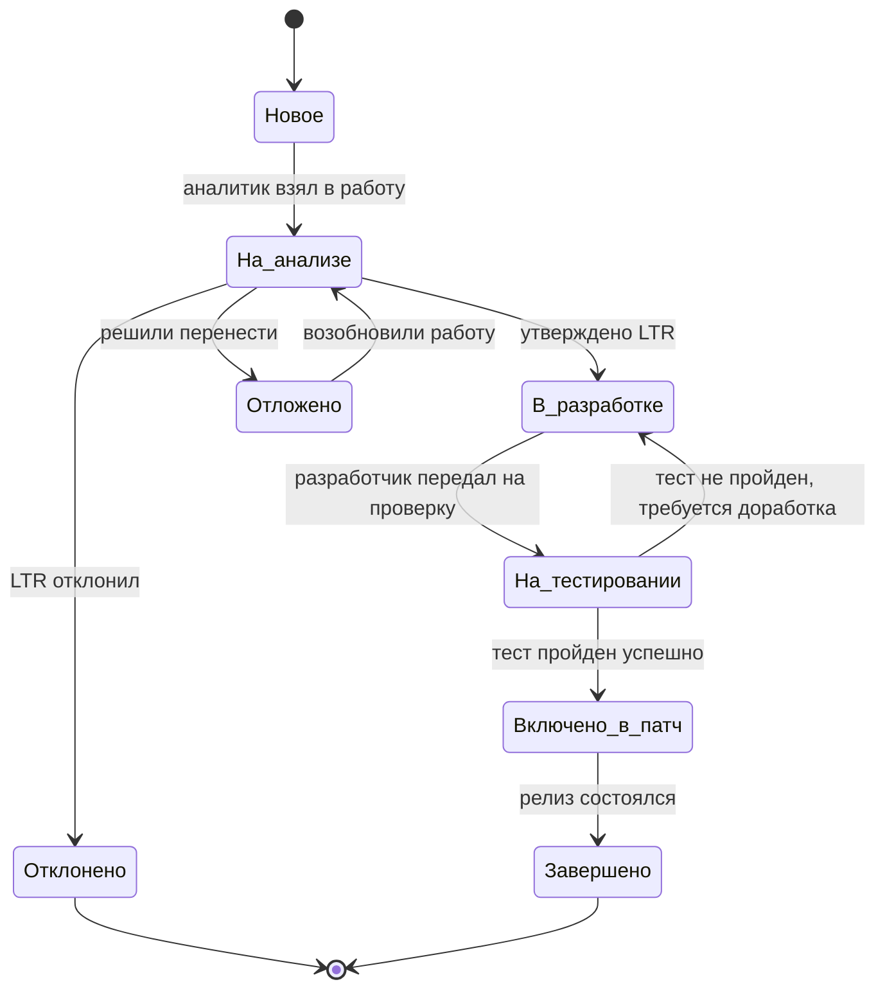

# Exercise 00 — Выделение типов требований

## 1. Определение 4 типов требований и их идентификаторов

| №    | Тип требования                                     | Трёхбуквенный ID | Назначение                                               | Примеры артефактов                                           |
| :--- | :------------------------------------------------- | :--------------- | :------------------------------------------------------- | :----------------------------------------------------------- |
| 1    | Бизнес-требования                                  | **BSN**          | Цели, задачи, бизнес-правила, KPI                        | Документ «Видение», метрики (снижение неявок на 30%), OKR    |
| 2    | Требования пользователей (заинтересованных сторон) | **USR**          | User Stories, Use Cases, диаграммы бизнес-процессов      | BPMN диаграммы, карты пользовательских путей, схемы экранов  |
| 3    | Функциональные требования к системе                | **FUN**          | Спецификации функций, логика работы, интерфейсы (UI/API) | CRUD-операции, статусные модели, API-эндпоинты, экранные формы |
| 4    | Нефункциональные требования к системе              | **NON**          | Атрибуты качества системы                                | SLA, время отклика, политики безопасности, нагрузочное тестирование |

**Формат ID:** `<тип>-<6 цифр>`, например `BSN-000001`, `USR-000012`, `FUN-000023`, `NON-000034`.

------

## 2. Атрибуты требований для каждого типа

### 2.1. Группа «Состояние» 

| №    | Атрибут                                | Тип данных | Формат                               | Пояснение                               |
| :--- | :------------------------------------- | :--------- | :----------------------------------- | :-------------------------------------- |
| 1    | Дата и время создания                  | DateTime   | `YYYY-MM-DD HH:MM:SS`                | Момент первичной регистрации требования |
| 2    | Дата и время перевода в текущий статус | DateTime   | `YYYY-MM-DD HH:MM:SS`                | Когда последний раз изменили статус     |
| 3    | Статус требования                      | Enum       | 8 значений (см. раздел 3)            | Текущее состояние в жизненном цикле     |
| 4    | Приоритет требования                   | Enum       | Высокий / Высокий / Средний / Низкий | Важность для ближайшего релиза          |
| 5    | Версия продукта                        | String     | `vX.Y`                               | Релиз, куда входит требование           |
| 6    | Патч (спринт, выпуск)                  | String     | `Sprint N` / `Release X.Y.Z`         | Детализация планирования                |

### 2.2. Группа «Описание и обоснование»

| №    | Атрибут                           | Ограничение     | Тип данных    | Пояснение                                                    |
| :--- | :-------------------------------- | :-------------- | :------------ | :----------------------------------------------------------- |
| 7    | Краткое наименование              | ≤ 50 символов   | String        | Лаконичное название для идентификации в списке               |
| 8    | Описание требования               | ≤ 150 символов  | Text          | Краткая суть требования                                      |
| 9    | Размещение материалов             | URL / путь      | String        | Ссылка на BPMN, макет, документ, схему БД                    |
| 10   | Метод проверки / критерий приемки | свободный текст | Text          | Как убедиться, что требование выполнено (тест-кейс, демонстрация, инспекция) |
| 11   | Источник (вышестоящее требование) | ID требования   | String        | Для USR → BSN, для FUN → USR, для NON → BSN                  |
| 12   | Связи требования                  | список ID       | Array[String] | Горизонтальные ссылки на смежные требования                  |

### 2.3. Группа «Ответственные лица»

| №    | Атрибут                         | Тип данных           | Пояснение                                |
| :--- | :------------------------------ | :------------------- | :--------------------------------------- |
| 13   | Текущий исполнитель             | String (ФИО / login) | Кто сейчас работает над требованием      |
| 14   | Лицо, принимающее решение (LTR) | String (ФИО / login) | Кто утверждает или отклоняет требование  |
| 15   | Автор требования                | String (ФИО / login) | Кто зарегистрировал требование в системе |

------

## 3. Статусы требований (8 статусов с описанием и диаграммой)

### 3.1. Перечень статусов

| №    | Статус              | Описание                                                     |
| :--- | :------------------ | :----------------------------------------------------------- |
| 1    | **Новое**           | Требование только создано, не взято в работу, ожидает рассмотрения аналитиком |
| 2    | **На анализе**      | Аналитик взял в работу, прорабатывает детали, уточняет критерии |
| 3    | **В разработке**    | Утверждённое требование передано разработчику, идёт реализация |
| 4    | **На тестировании** | Реализация завершена, тестировщик проверяет соответствие критериям |
| 5    | **Включено в патч** | Тестирование пройдено, требование включено в релизный пакет  |
| 6    | **Отклонено**       | Требование признано нецелесообразным, дублирующим или технически невозможным |
| 7    | **Отложено**        | Реализация перенесена на будущие версии (более поздние спринты) |
| 8    | **Завершено**       | Требование выпущено в релизе, работа полностью завершена     |

### 3.2. Диаграмма переходов между статусами (текстовое описание  и диаграмма)

text

```
Новое → На анализе (аналитик взял в работу)
На анализе → В разработке (утверждено LTR)
На анализе → Отклонено (LTR отклонил)
На анализе → Отложено (решили перенести)
В разработке → На тестировании (разработчик передал на проверку)
На тестировании → Включено в патч (тест пройден успешно)
На тестировании → В разработке (тест не пройден, требуется доработка)
Включено в патч → Завершено (релиз состоялся)
Отложено → На анализе (возобновили работу)
Отклонено → (конечное состояние)
Завершено → (конечное состояние)
```

  



------

## 4. Платформа управления задачами

Для ведения реестра требований и управления задачами используется платформа **WEEEK** (https://weeek.net/ru). *Ссылка для просмотра https://app.weeek.net/ws/979952/shared/board/mxvHydIyUTFMVtFPiNn75Sa3fZxwzWAT 

- **Проект:** BAR — Онлайн-запись барбершопа
- **Доска:** Реестр требований (колонки = 8 статусам)
- **Типы задач в WEEEK:** Бизнес-требование, Требование стейкхолдера, Функциональное требование, Нефункциональное требование
- **Кастомные поля в WEEEK:** Приоритет, Версия, Спринт, Источник, Связи, Исполнитель, LTR, Автор                                    

## 4.1 Подтверждение регистрации требований в WEEEK

В системе WEEEK созданы карточки всех требований:

- BSN
- USR
- FUN
- NON

Для карточек настроены следующие поля:

- Статус
- Приоритет
- Версия продукта
- Патч (спринт)
- Источник
- Связи
- Исполнитель
- LTR
- Автор

### Приложенные скриншоты

Приложение А — доска проекта BAR.

Приложение Б — карточка BSN-000004.

Приложение В — карточка USR-000009.

Приложение Г — карточка FUN-000004.

Приложение Д — карточка NON-000006.

------

## 5. Реестр требований в WEEEK 

### 5.1. Бизнес-требования (BSN)

| ID         | Краткое наименование             | Описание (≤150 символов)                                     | Статус          | Приоритет | Версия | Патч     | LTR       | Автор         |
| :--------- | :------------------------------- | :----------------------------------------------------------- | :-------------- | :-------- | :----- | :------- | :-------- | :------------ |
| BSN-000001 | Расширение клиентской базы       | Увеличить количество клиентов за счёт онлайн-записи на 20% за 6 месяцев | На анализе      | Высокий   | v1.0   | Sprint 1 | tech_lead | product_owner |
| BSN-000002 | Снижение трудозатрат сотрудников | Сократить ручной труд менеджеров на 40% за счёт автоматизации уведомлений | В разработке    | Высокий   | v1.0   | Sprint 2 | tech_lead | product_owner |
| BSN-000003 | Сокращение неявок                | Снизить количество клиентов, забывших о записи, на 30% за счёт напоминаний | В разработке    | Высокий   | v1.0   | Sprint 2 | tech_lead | product_owner |
| BSN-000004 | Автоматизация напоминаний        | Полностью автоматизировать процесс информирования клиентов о предстоящих визитах | На тестировании | Высокий   | v1.0   | Sprint 2 | tech_lead | product_owner |

### 5.2. Требования пользователей (USR)

| ID         | Краткое наименование                           | Описание (≤150 символов)                                     | Статус       | Приоритет | Источник   | Связи                  | Исполнитель |
| :--------- | :--------------------------------------------- | :----------------------------------------------------------- | :----------- | :-------- | :--------- | :--------------------- | :---------- |
| USR-000001 | Менеджер вводит расписание мастеров            | Менеджер создаёт слоты для мастеров (дата, время, мастер) для дальнейшей записи клиентов | В разработке | Высокий   | BSN-000001 | USR-000002             | dev_1       |
| USR-000002 | Клиент записывается онлайн                     | Клиент выбирает услугу, мастера и свободное время для бронирования | В разработке | Высокий   | BSN-000001 | USR-000001, USR-000003 | dev_2       |
| USR-000003 | Клиент выбирает канал уведомлений              | Клиент в профиле выбирает Telegram, WhatsApp, VK или SMS для получения напоминаний | На анализе   | Высокий   | BSN-000004 | USR-000002, USR-000004 | analyst     |
| USR-000004 | Менеджер настраивает расписание напоминаний    | Менеджер задаёт интервалы отправки (за 24ч, за 1ч) и шаблоны сообщений | На анализе   | Высокий   | BSN-000004 | USR-000001, USR-000003 | analyst     |
| USR-000005 | Мастер смотрит расписание                      | Мастер просматривает свои слоты и записи клиентов на определённую дату | На анализе   | Средний   | BSN-000001 | USR-000001             | dev_1       |
| USR-000006 | Менеджер информирует клиентов                  | Менеджер настраивает автоматическую отправку напоминаний клиентам о предстоящем визите | На анализе   | Высокий   | BSN-000004 | USR-000004, USR-000007 | analyst     |
| USR-000007 | Клиент получает напоминание                    | Клиент получает автоматическое сообщение с датой, временем, мастером и адресом | В разработке | Высокий   | BSN-000003 | USR-000003, USR-000006 | dev_2       |
| USR-000008 | Клиент выбирает канал связи                    | Клиент может выбрать один или несколько каналов в настройках профиля | На анализе   | Высокий   | BSN-000004 | USR-000003, USR-000007 | analyst     |
| USR-000009 | Менеджер настраивает расписание информирования | Менеджер создаёт несколько правил (48ч, 24ч, 2ч, 15 мин) с возможностью включения/отключения | На анализе   | Высокий   | BSN-000004 | USR-000006, USR-000008 | analyst     |

### 5.3. Функциональные требования (FUN)

| ID         | Краткое наименование                | Описание (≤150 символов)                                     | Статус          | Приоритет | Источник               | Связи                  | Исполнитель |
| :--------- | :---------------------------------- | :----------------------------------------------------------- | :-------------- | :-------- | :--------------------- | :--------------------- | :---------- |
| FUN-000001 | Создание слота мастера (UC02)       | Система сохраняет слот (дата, время, мастер) со статусом «Свободен» после проверки | В разработке    | Высокий   | USR-000001             | FUN-000002             | dev_1       |
| FUN-000002 | Проверка бронирования слота         | Система проверяет, не забронирован ли слот клиентом перед созданием | На тестировании | Высокий   | USR-000001, USR-000002 | FUN-000001             | dev_2       |
| FUN-000003 | Сохранение настроек напоминаний     | Система хранит JSON-конфиг с правилами: интервалы, шаблоны, каналы по умолчанию | На анализе      | Высокий   | USR-000009             | FUN-000004, FUN-000005 | dev_1       |
| FUN-000004 | Автоматическая отправка напоминаний | Планировщик каждые 10 минут проверяет записи и отправляет сообщения через API каналов | На анализе      | Высокий   | USR-000007, USR-000008 | FUN-000003, FUN-000006 | dev_2       |
| FUN-000005 | UI настройки расписания (менеджер)  | Экранная форма для менеджера: список правил, интервалы, шаблоны, предпросмотр | На анализе      | Средний   | USR-000009             | FUN-000003             | dev_1       |
| FUN-000006 | UI журнала отправок                 | Таблица со списком отправок, статусами, фильтрами и кнопкой повторной отправки | Новое           | Низкий    | FUN-000004             | FUN-000004             | dev_2       |
| FUN-000007 | API проверки бронирования           | Эндпоинт GET /api/v1/slots/check, возвращает статус слота (свободен/забронирован) | На тестировании | Высокий   | USR-000001             | FUN-000002             | dev_2       |
| FUN-000008 | API создания слота                  | Эндпоинт POST /api/v1/slots, создаёт слот после валидации    | В разработке    | Высокий   | USR-000001             | FUN-000001             | dev_1       |

### 5.4. Нефункциональные требования (NON)

| ID         | Краткое наименование     | Описание (≤150 символов)                                     | Статус       | Приоритет | Источник                          | Исполнитель |
| :--------- | :----------------------- | :----------------------------------------------------------- | :----------- | :-------- | :-------------------------------- | :---------- |
| NON-000001 | Время отклика UI         | Любое действие в интерфейсе (создание слота, проверка) должно занимать не более 2 секунд | На анализе   | Высокий   | BSN-000001                        | dev_ops     |
| NON-000002 | Доступность системы      | Система должна быть доступна 99.5% времени (не более 3.6 часов недоступности в месяц) | На анализе   | Высокий   | BSN-000001                        | dev_ops     |
| NON-000003 | Логирование действий     | Все действия менеджера с расписанием (создание, удаление, изменение) логируются с timestamp и user_id | На анализе   | Средний   | BSN-000002                        | dev_1       |
| NON-000004 | Шифрование каналов       | Все внешние API (Telegram, WhatsApp, SMS) должны использовать TLS 1.2+ | В разработке | Высокий   | BSN-000001                        | dev_ops     |
| NON-000005 | Надёжность отправки      | При недоступности канала — 3 повтора с интервалом 15 минут, запись в лог ошибок | На анализе   | Высокий   | BSN-000003                        | dev_2       |
| NON-000006 | Безопасность авторизации | Только сотрудники с ролью «Менеджер» могут настраивать расписание и уведомления | На анализе   | Высокий   | BSN-000004 FUN-000003, FUN-000005 | dev_ops     |
